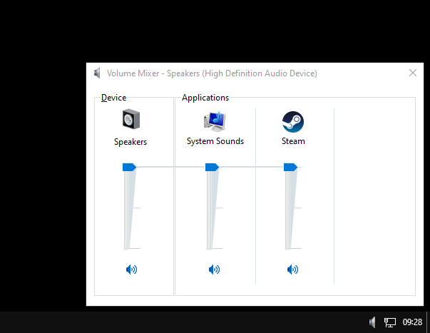

# volume-mixer-tray
This is an AutoHotkey (AHK) script that provides a convenient system tray menu to quickly open and manage the Windows Volume Mixer. The script positions the Volume Mixer window in the bottom-right corner of the screen.



## Features
- System tray icon for quick access.
- Opens the Windows Volume Mixer and positions it in the bottom-right corner.

## Installation
### Easy Way
1. Download [Latest Release](https://github.com/nukhes/volume-mixer-tray/releases/tag/stable).
2. Enjoy.

### Script Method
1. Download and install [AutoHotkey](https://www.autohotkey.com/).
2. Clone this repository or download the script file:
   ```bash
   git clone https://github.com/yourusername/volume-mixer-tray.git
   cd volume-mixer-tray
3. Save the script (VolumeMixer.ahk) in a folder of your choice.

## Usage Tips
If you want the script or the executable to start automatically when you log in to Windows, follow these steps:

1. Right-click the file (VolumeMixer.ahk or volume-mixer.exe) and select Create Shortcut.
2. Press Win + R to open the Run dialog box.
3. Type `shell:startup` and press Enter. This will open the Startup folder.
4. Drag and drop the shortcut into the Startup folder.

The script will now run automatically every time you start your computer. 🎉
